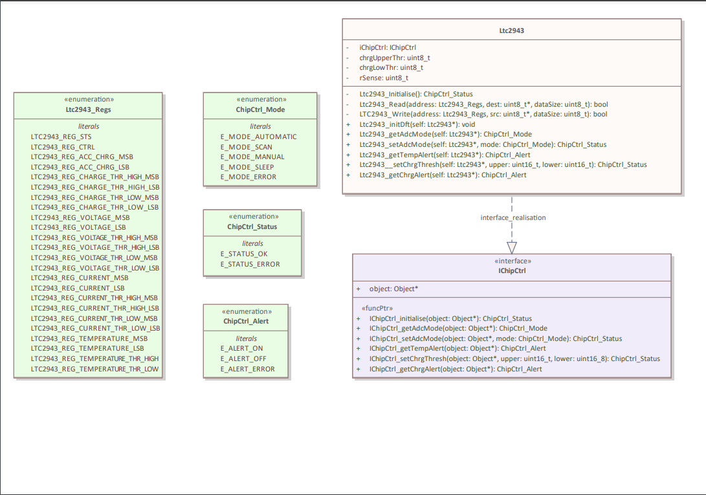

## Ltc2943 Driver

A simple driver for the L [tc2943 Multicell Battery Gas Gauge](https://www.analog.com/media/en/technical-documentation/data-sheets/2943fa.pdf).

The following interfaces have been implemented:
- getAdcMode : Get the adc mode 
- setAdcMode: Set the adc mode 
- getTempAlert: Get the temperature alert
- setChrgThr: Set the charge thresholds
- getChrgAlert: Check that the charge is within threshold.

Note: This component has not been unit tested.

The following class diagram shows the design of the module. 

